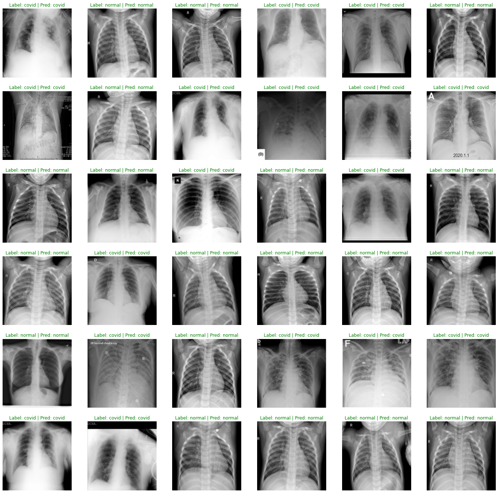
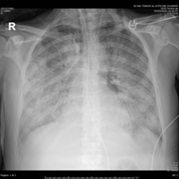
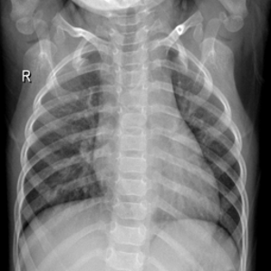

# Lung Covid Classification using ResNet34 on Vortex



## Introduction
This is API for predict X-Ray Lung image to classify covid or normal using Vortex.

## Tutorial

Clone the project

```bash
  git clone https://github.com/brianadit24/LungCovidClassificationVortex
```

Go to the project directory

```bash
  cd LungCovidClassificationVortex
```

Create and start API service

```bash
  docker-compose up
```

Stop and remove API service

```bash
  docker-compose down
```

  
## API Reference

Service: http://your-ip-address:8080

#### POST image

```http
  POST /predict
```
Content-Type: multipart/form-data
| Name    | Type   | Description                                         |
| :------ | :----- | :-------------------------------------------------- |
| `image` | `file` | **Required**. `image/jpeg` or `image/png` MIME Type |


## Result Example

**Input:**<br>


**Output:**<br>
```python
  {
  "confidence": "0.9827859",
  "result": "covid"
}
```

---

**Input:**<br>


**Output:**<br>
```python
  {
  "confidence": "0.9837899",
  "result": "normal"
}
```
  
## Feedback

If you have any feedback, please reach out to us at brian.adityaherman@gmail.com

  
## 🔗 Contact Me
[](https://www.linkedin.com/in/brianadityah/)

  
